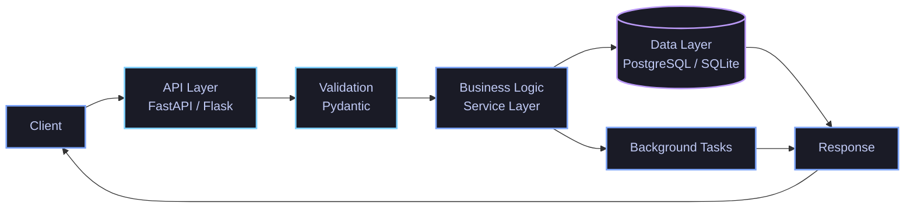
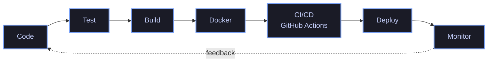

<!--
PERSONALIZE BEFORE YOU PUSH — find & replace:
  YOUR NAME              → Sudhanva Patil (appears in the hero banner + whoami block)
  YOUR_USERNAME           → Sudhanva777 username (used in every stats/badge URL below)
  YOUR_LINKEDIN            → Sudhanva Patil  handle
  YOUR_EMAIL               → sudhanvapatil2004@gmail.com address
  YOUR_PORTFOLIO_URL       → your site (or delete that one badge)
  [Project ...] blocks      → swap in your 3 real projects
  Any other [bracketed] text → fill in or delete
Everything here is plain Markdown + hosted SVG widgets — no GitHub Action required.
-->

<div align="center">


[](https://github.com/YOUR_USERNAME)

<br>

[](https://github.com/YOUR_USERNAME)
[](https://linkedin.com/in/YOUR_LINKEDIN)
[](mailto:YOUR_EMAIL)
[](https://YOUR_PORTFOLIO_URL)


</div>

<br>

## 👋 A Quick `whoami`


```python
class BackendEngineer:
    def __init__(self):
        self.name = "Sudhanva Patil"
        self.title = "Python Backend Engineer"
        self.also_known_for = ("API Developer", "Software Engineer")
        self.core_stack = ["Python", "FastAPI", "PostgreSQL", "Docker"]
        self.currently = "building, breaking, and rebuilding backend systems"

    def philosophy(self) -> str:
        return "An API is a contract. A database is architecture, not an afterthought."

    def status(self) -> str:
        return "🟢 open to interesting backend problems"


me = BackendEngineer()
```

Most of what I do lives below the UI — the part of the stack nobody screenshots. I like it there. That's where a request either survives contact with a real system or it doesn't: validation that doesn't trust the client, a schema that won't fall apart in six months, a deploy that doesn't page anyone at 2 AM.

If that sounds like your kind of problem too, keep scrolling — it gets more technical from here.

<br>

## 🏗️ System Architecture <sub>(a.k.a. how I'd actually describe my own skill set)</sub>


Less a list, more a diagram. Here's roughly how a request moves through what I know:



And the layer that decides whether any of this survives past `git push`:



Now the same map, broken into layers you can actually expand:

<details>
<summary><b>🐍 Core Layer — Python Engineering</b></summary>
<br>


- Python, OOP, data structures & algorithms
- Clean code, type hints, structured error handling
- Testing, and the kind of debugging that actually teaches you something

> Before I write an API, I want to trust the code underneath it.

</details>

<details>
<summary><b>🔌 API Layer — API Development</b></summary>
<br>


- REST API design, routing, request/response lifecycle
- Pydantic validation, JWT authentication & authorization
- API versioning, proper HTTP status codes, OpenAPI/Swagger docs
- WebSockets, when the problem actually calls for them

> An API is a contract, not just a collection of routes. *(More on this below — it's kind of my thing.)*

</details>

<details>
<summary><b>⚙️ Backend Engineering Layer</b></summary>
<br>

- Service-layer design, modular application structure
- Authentication, authorization, structured logging
- Exception handling, background processing
- System design — thinking past the happy path

> Anyone can create an endpoint. The interesting part is everything that happens before and after it.

</details>

<details>
<summary><b>🗄️ Data Layer</b></summary>
<br>


- SQL, schema design, relationships, constraints, CRUD
- SQLAlchemy, query optimization, data persistence
- Pandas & NumPy for the data-wrangling side of backend work

> The database is part of the architecture, not an afterthought.

</details>

<details>
<summary><b>🚀 DevOps & Production Layer</b></summary>
<br>


- Git, Linux, Bash — the daily tools
- Docker & Docker Compose, containerization, env/config management
- CI/CD fundamentals with GitHub Actions
- Reverse proxy concepts (Nginx), process management, monitoring fundamentals

> Deployment is part of development, not a separate job that happens to someone else.

</details>

<details>
<summary><b>🧠 Data & AI Integration Layer <sub>(supporting, not my main identity)</sub></b></summary>
<br>


- Data processing with Pandas & NumPy
- Model inference and integration — Scikit-learn, XGBoost, TensorFlow/Keras, OpenCV

> I don't reach for ML because it's exciting. I reach for it when the product actually needs it — then I wire it into the backend like any other service.

</details>

<br>

## 🔌 API Development — Where Most of My Attention Goes


This is the part of backend engineering I actually get excited about. Not "add an endpoint" — the whole shape of how a request becomes a response:

`Client → Router → Validation → Business Logic → Database → Response`

What I spend most of my time thinking about:

- Designing routes that make sense a year later, not just today
- Validating everything at the edge, trusting nothing from the client
- Authentication & authorization that's actually enforced, not just implemented
- Status codes and error shapes that tell the caller the truth
- Documentation (OpenAPI/Swagger) that means nobody has to ask me what a field does

A small, honest example of the shape I like to write:

```python
from fastapi import FastAPI, HTTPException, status
from pydantic import BaseModel

app = FastAPI()

class UserCreate(BaseModel):
    email: str
    username: str

class UserOut(BaseModel):
    id: int
    username: str

@app.post("/users", response_model=UserOut, status_code=status.HTTP_201_CREATED)
def create_user(payload: UserCreate):
    if user_exists(payload.email):
        raise HTTPException(status.HTTP_409_CONFLICT, "User already exists")
    return save_user(payload)
```

> A 200 that returns the wrong shape is still a bug. The contract matters as much as the response.

<br>

## 🚀 Featured Projects


A few things I've actually built end to end — API down to database, with enough DevOps around them to be more than a script on my laptop.

<details>
<summary><b>🔹 [Project One — e.g. a REST API with auth & a real database]</b></summary>
<br>

**The problem it solves:** [what real need or itch started this project]

**The interesting part:** [the specific engineering challenge — a schema decision, an auth flow, a concurrency issue, whatever made this worth writing about]

**How a request flows through it:**
`Client → [Endpoint] → [Validation] → [Business Logic] → [Database] → Response`

**Built with:** [FastAPI / Flask, PostgreSQL, Docker — swap in your real stack]

**Why I built it:** [the actual reason]

🔗 [Explore the repository →](https://github.com/YOUR_USERNAME/project-one)

</details>

<details>
<summary><b>🔹 [Project Two — e.g. something with a real deployment story]</b></summary>
<br>

**The problem it solves:** [...]

**The interesting part:** [...]

**Getting it into production:** [Docker → CI/CD → deploy — what the pipeline actually looked like]

**Built with:** [your real stack]

**Why I built it:** [...]

🔗 [Explore the repository →](https://github.com/YOUR_USERNAME/project-two)

</details>

<details>
<summary><b>🔹 [Project Three — e.g. a backend service wrapping a data/ML model]</b></summary>
<br>

**The problem it solves:** [...]

**The interesting part:** [how the data/AI piece got wired into a normal backend service, not the other way around]

**How a request flows through it:**
`Client → API → [Model Inference] → [Database/Cache] → Response`

**Built with:** [your real stack]

**Why I built it:** [...]

🔗 [Explore the repository →](https://github.com/YOUR_USERNAME/project-three)

</details>

<br>

## 🚀 DevOps & Deployment


There's a specific gap I like closing: *"it works on my machine"* → *"it's running reliably in production."* That gap is basically what DevOps means to me right now — not infrastructure for its own sake, but the discipline of making software survive contact with the real world.

```dockerfile
FROM python:3.12-slim

WORKDIR /app
COPY requirements.txt .
RUN pip install --no-cache-dir -r requirements.txt

COPY . .
EXPOSE 8000

CMD ["uvicorn", "main:app", "--host", "0.0.0.0", "--port", "8000"]
```

Nothing exotic — just making sure `docker build && docker run` gets you the same thing on your laptop and on a server. From there: `Code → Test → Build → Docker → Deploy → Monitor`, with GitHub Actions doing the parts I shouldn't have to remember to do manually.

> If the logs can't explain what happened, the system isn't finished.

<br>

## 🧭 Current Journey


### 🔧 What I'm Building Right Now

[Currently: one or two sentences on what you're actually building, written like a devlog entry, not a resume bullet.]

The part I'm actually wrestling with: [a specific technical snag — cache invalidation, a schema that needs to survive a feature you haven't built yet, whatever it really is].

### 🧪 Things I'm Experimenting With

- API architecture patterns — rate limiting, idempotency, versioning strategies
- Backend performance and caching
- Database indexing and query optimization
- Multi-service Docker Compose setups
- CI/CD pipelines with GitHub Actions
- System design at the "what breaks at 10x traffic" level

### 🧠 Engineering Opinions <sub>(held with mild stubbornness)</sub>

> "An API is a contract, not just a collection of routes."

> "The database is part of the architecture, not an afterthought."

> "Deployment is part of development."

> "If the logs can't explain what happened, the system isn't finished."

> "Fast and wrong is slower than slow and right — you just find out later."

> "The best code is the code someone else can debug at 3 AM without calling you."

### 🤝 If You Like Talking About...

- Python and backend code that's actually clean, not just working
- API design — and why REST still isn't "solved"
- Databases, indexes, and the one query that ruins your afternoon
- Docker, CI/CD, and getting code into production
- System design — the "what breaks at scale" kind of conversation
- Building things from scratch, badly at first, then less badly

...we'll get along. Scroll down and say hi.

<br>

## 📊 The Numbers <sub>(updated automatically, not by me)</sub>


<p align="center">
  
  
</p>

<p align="center">
  
</p>

<p align="center">
  
</p>

<details>
<summary><b>🏆 Trophy case</b></summary>
<br>
<p align="center">

</p>
</details>

<br>

## 💬 Let's Talk Backend


If you've read this far, you already know more about how I think than most cover letters manage. I'd rather talk about the API you're debugging, the schema decision you're stuck on, or the thing you're building than trade generic pleasantries.

Open an issue, send a PR, or just say hi — I read everything that lands here.

<div align="center">

[](https://github.com/YOUR_USERNAME)
[](https://linkedin.com/in/YOUR_LINKEDIN)
[](mailto:YOUR_EMAIL)

<br>


</div>
